[toc]

# Hadoop相关概念

BIg Data

```she	
	Volume  
	Velocity（快速） 
	Variety (结构化数据和非结构化数据)
	Value(低价值密度)：价值密度的大小与数据总量的大小成反比
```

HIVE：存储 查询和分析存储在hdfs上的大量数据

缺点 ：不支持事务，不可以修改数据，只可以通过文件追加和重新上传  速度很慢

ZOOkeeper“zn+1哥服务器允许n此错误。


结构化数据

```she
数据库这种有二维表格的
```

半结构化数据

```shell
类似于一个文件，但是可以导入mysql这种结构化数据中
```


非结构化数据

```she	
无法转化，视频，ppt等
```

Hadoop

```she
分布式系统基础架构：多台服务器共同完成某一任务
主要解决海量数据的存储和分析计算
```

三大发行版本

```shell	
Apache 最基础
Cloudera   Horntownworks

```

Hadoop优势

```shel
高可靠性：底层维护多个数据副本，即使某个元素或存储出现故障，data-loss is avoided
高扩展性：在集群间分配任务数据，可方便扩展节点，动态增加和动态删除
高效性：hadoop是并行工作的
高容错性：能够自动将失败任务重新分配
```

hadoop组成（important）

```shel
Hadoop 1.x:
	HDFS:数据存储   
	Mapduce：计算+资源调度
	Common：辅助工具
Hadoop 2.x:
	多了Yarn用于资源调度
Hadoop 3.x：
	在组成上没有区别
```


HDFS数据存储

```shell	\
NameNode:存储文件的元数据，如文件名，文件目录结构，文件属性等 保存在linux中
DataNode：存储文件块数据，以及快数据的校验和{
	文件块：最基本的存储单位
	HDFS默认的block大小是64MB（老版本)
	不同于普通文件系统的是，如果一个文件小于一个数据块的大小，并不占用整个数据块存储空间
	Replication：多复本  默认是三个，可通过配置文件配置
}
2NN:每隔一段时间对NameNode元数据备份,只能恢复一部分数据而非所有
```

关于replication的解析：<a href=https://www.jianshu.com/p/a06ad4b7b089>


Yarn架构

```shell
Resource Manager:管理整个集群资源  rm将资源部份安排给基础大的Node Manager
{
	*NM遵循来自RM的一些指令来管理单一节点上的可用资源
	*AM负责与RM协商资源并于NM合作启动容器
}
Node Manager:管理单个节点的服务器资源  是yarn中每个节点上的代理  与RM通讯 监督container的生命周期
ApplicationMaster：单个运行任务的boss 流程如下
	和rm协商，获取资源 通过rm来获取任务 和NM启动任务 Map或Reduce
---------------	
Container：容器，相当于于一台独立服务器，封装任务运行需要的资源  封装的是某个DataNode节点上的资源
AppMaster请求资源时，RM以container的形式返回资源

Scheduler:资源调度器根据队列容量，队列限制，为每个应用分配一定的资源。（只是单纯的资源调度，不参与任何任务状态管理）
```


MapReduce架构

```shel
计算分为两个阶段：Map 和Reduce
```

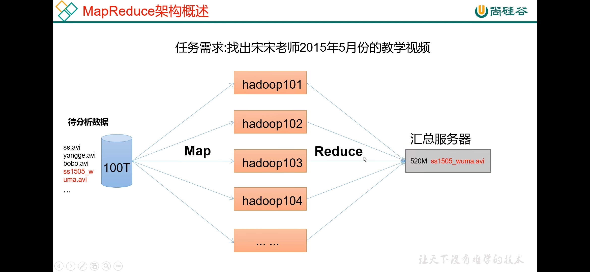


HDFS&Yarn&MapReduce

```shell
remain to be done
```


Hadoop运行模式	

```
Local:数据存储再linux本地，从本地读取  ~测试偶尔会用
伪分布式（pseudo-distributed）：数据存储在HDFS ~公司比较差钱
完全分布式（fully-distributed）:数据也是存储在HDFS，但是多台服务器工作 ~大量使用
```

tip

```shel
后续写的mapreduce程序必须指定对应的输入路径和输出路径，而且输出路径还不能存在，存在的话会直接抛出异常。 Get it!
```


**Hadoop官方文档：**[FileSystem (Apache Hadoop Main 3.3.1 API)](https://hadoop.apache.org/docs/current/api/org/apache/hadoop/fs/FileSystem.html)

# HDFS

## Introduction

分布式文件系统，建立在一次写入，多次读取的思想上。

**一个hdfs集群是由一个namenode和多个datanode形成**，内部机制是将一个文件分割成一个或多个的block，这些块储存在一组数据节点中。

**namenode负责文件或目录的“打开，关闭，重命名等”,并确定块与数据节点的映射。而数据节点负责来自文件系统客户的读写请求**


## HDFS 块

- 默认的最基本的存储单位是64M的数据块**（默认大小在hadoop2.x版本中是128M，老版本中是64M）**
- HDFS的文件是被分成64M一块的数据块进行存储的
- HDFS中若一个文件大小小于64M，并不占用整个存储空间

### 1）hadoop block存放策略

- 第一个block放在client所在的node里面
- 第二个放在与第一个不同的机架中的node中
- 第三个放在与第一个块的同一个机架的不用node中


### 2）NameNode和DataNode

- NameNode(元数据节点)：用来管理文件系统的命名空间
  - 将所有文件和文件夹的元数据保存在一个system tree上（ 元数据 ：指用来描述一个 文件 的特征的系统数据，诸如访问权限、 文件 拥有者、以及 文件 数据块的分布信息等等）
  - 也同时会在硬盘上保存成这些文件：namespace image 和editlog
  - 也存储了一个文件包含哪些数据块，分布在哪些数据节点上
  - **注意：这些信息并不真正存储在硬盘 而是存放在数据节点中**
  - client和namenode可以向数据节点请求写入或者读出数据块，并周期性的向namenode汇报其存储的数据块信息
  - **元数据节点目录结构：在hdfs-site.xml中配置dfs.name.dir参数**<!--surfing online to search how to makit -->

```shell
namespaceID=123214214 文件系统的唯一标识符 在文件系统初始化时生成的
ClusterID=xxxxxxxxx   系统生成或手动指定的集群ID，可以在-clusteid选项中使用
cTime=0               0此处标识namenode的创建时间，更新nd后会更新时间戳
storageType=NAME_NODE 表示此文件夹中保存的是元数据节点的数据结构
LayoutVersion 		  保存格式版本号
```

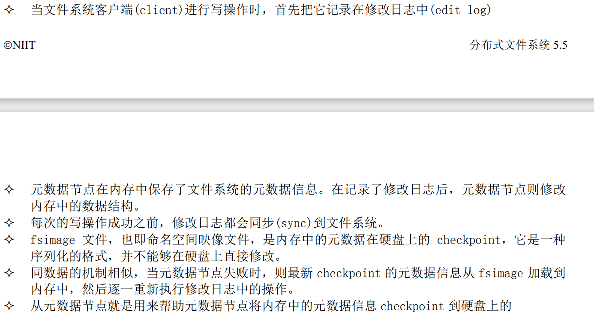


**checkpoint的作用：1）保证数据库的一致性，这是指将脏数据写入到硬盘，保证内存和硬盘上的数据是一样的;2）缩短实例恢复的时间**

### 3）HDFS通信协议

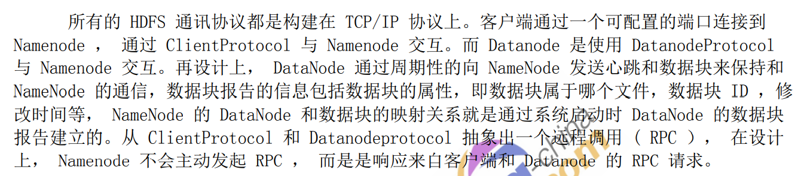

### 4）HDFS的安全模式

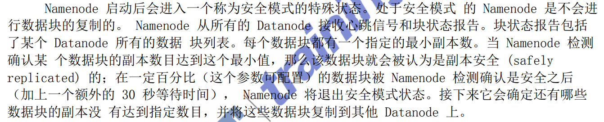


### 5）客户端读文件

```java	
//工具类获取FileSystem
 String uri = "域名"; //like "hdfs://niit1:9000"
        Configuration conf = new Configuration();
        FileSystem fs= FileSystem.get(URI.create(uri),conf,"你的用户名,也可以不加，区别建议查阅官方API");
```


```java	
String uri = "hdfs://niit1:9000";
        Configuration conf = new Configuration();
        FileSystem fs= FileSystem.get(URI.create(uri),conf);

        byte[] file_content_buff = "hello hadoop world,test write file! \n".getBytes();//以字节数组的形式读取字符串
        Path dfs = new Path("/user/root/niit/nn.txt"); //写入文件路径
        FSDataOutputStream outputStream = fs.create(dfs);
        //create file两种形式 1）使用setpermission提供的权限来设置权限 2）将配置中的umask改为0--->但并非线程安全的
        outputStream.write(file_content_buff,0,file_content_buff.length);//写入文件
        fs.close();
```

| `static FileSystem` | `get(URI uri, Configuration conf)`Get a FileSystem for this URI's scheme and authority. |
| ------------------- | ------------------------------------------------------------ |
| `static FileSystem` | `get(URI uri, Configuration conf, String user)`Get a FileSystem instance based on the uri, the passed in configuration and the user. |

### 6）客户端写文件

```java	
  FileSystem fs = (new GetFileSystem()).getSystem(); //GetFileSystem是上面的工具类 用来获取FileSystem
        InputStream in =null;
        try {
            //Opens an FSDataInputStream at the indicated Path.
            in = fs.open(new Path("/user/root/niit/nn1.txt"));
            IOUtils.copyBytes(in,System.out,4096,false);
            //(InputStream in, OutputStream out, int buffSize, boolean close)
        } finally {
            IOUtils.closeStream(in);
        }

```


### 7）本地文件上传到HDFS

使用 **copyFromLocalFile**接口

```java
public static void main(String[] args) throws IOException {
        FileSystem fs = (new GetFileSystem()).getSystem();
        Path src = new Path("本地文件路径");
        Path desc = new Path("目标路径");
        fs.copyFromLocalFile(src,desc);
    }
```

### 8）重命名文件

使用rename（抽象类）返回布尔值

```java
 FileSystem fs = (new GetFileSystem()).getSystem();
        //已经在classpath下面加载了hdfs-site.xml和core-site.xml的配置文件，则会自动理解输入的文件路径为hdfs的
        Path CurrentName = new Path("当前文件路径及文件名");
        Path desName = new Path("目标文件名");  //是否可以同时修改文件路径?YESSSSSSS!!!!
        boolean result = fs.rename(CurrentName,desName);
        System.out.println(result==true?"修改成功":"修改失败");
```


### 9）Delete File & Directory

```java	
FileSystem fs = (new GetFileSystem()).getSystem();
        Path delef = new Path("删除的目标地址");
        boolean deleRe = fs.delete(delef,true);
        System.out.println(deleRe==true? "yes":"no");
```

### 10）创建目录和遍历目录

**创建过程和删除相似  无非是使用了mkdirs接口罢了**

遍历目录

```java
  public static void main(String[] args) throws IOException {
        FileSystem fs = (new GetFileSystem()).getSystem();
        FileStatus[] fsstatus = fs.listStatus(new Path("/user/root"));
        for(FileStatus status : fsstatus)
            if(status.isFile())
                System.out.println("file:"+status.getPath().toString());
            else
                System.out.println("directory:"+status.getPath().toString());
    }
```


| `abstract FileStatus[]` | `listStatus(Path f)`List the statuses of the files/directories in the given path if the path is a directory. |
| ----------------------- | ------------------------------------------------------------ |
| `FileStatus[]`          | `listStatus(Path[] files)`Filter files/directories in the given list of paths using default path filter. |
| `FileStatus[]`          | `listStatus(Path[] files, PathFilter filter)`Filter files/directories in the given list of paths using user-supplied path filter. |
| `FileStatus[]`          | `listStatus(Path f, PathFilter filter)`Filter files/directories in the given path using the user-supplied path filter. |

### HadoopShell Commands

```powershell
阿巴阿巴
```


# Hadoop IO

## 1）序列化

序列化：**将结构化对象转化为字节流以便于通过网络进行传输或写入持久存储的过程 反序列化则反之**

- 特点：

  - Compact: 方便网络传输

  - Fast：性能好

  - Extensible：协议有变化 可以支持新的需求（动态）

  - Interoperable：客户端和服务器端不依赖语言的实现（怎么去理解）

  - hadoop使用writables，满足compact fast 但是不满足拓展性 （这种序列化时hadoop自己实现的，而不是java的序列化）

    ```java	
    public interface Serialization<T> { 
     //客户端用于判断序列化实现是否支持该类对象 
     boolean accept(Class<?> c); 
    //获得用于序列化对象的 Serializer 实现 
     Serializer<T> getSerializer(Class<T> c); 
    //获得用于反序列化对象的 Deserializer 实现 
     Deserializer<T> getDeserializer(Class<T> c); 
    } 
    
    
    ```

## 2）序列化流程

- 如果需要**使用 Serializer **来执行序列化，一般需要通过 **open()**方法打开 Serializer，open()方法传入一个 底层的流对象，然后就可以使用**serialize()方法序列化对象**到底层的流中。最后序列化结束时，通过 close()方法关闭 Serializer。

```java
public interface Serializer<T> { 
 //为输出（序列化）对象做准备 
 void open(OutputStream out) throws IOException; 
 
//将对象序列化到底层的流中 
 void serialize(T t) throws IOException; 
 
//序列化结束，清理 
 void close() throws IOException; 
}
```

## 3）反序列化

- 如果要使用 **deserializer** 来执行反序列化，一般需要通过 open()方法打开 deserializer，open()方法传入 一个底层的流对象，然后就可以使用 deserializer()方法反序列化流到对象中。最后反序列化结束时， 通过 close()方法关闭 Serializer。

  ```java
  public interface deserializer<T> {
  void open(InputStream in) throws IOException; 
  T deserialize(T t) throws IOException;
  void close() throws IOException;
  } 
  
  ```

## 4）Writable接口

- **Hadoop 的所有可序列化对象都必须实现 这个接口。Writable 接口里有两个方法，一个是 write 方法，将对象写入字节流，另一个是 readFields 方法，从字节流解析出对象**。

```java
public byte[] serialize() throws IOException {
        IntWritable intWritable = new IntWritable(12);
        //生成流对象
        ByteArrayOutputStream byteArrayOutputStream = new ByteArrayOutputStream();
        DataOutputStream dataOutputStream = new DataOutputStream(byteArrayOutputStream);
        //DataStream封装byteStream

        //Serilization the data  序列化对象到流中
        intWritable.write(dataOutputStream);
        byte[] byteArray = byteArrayOutputStream.toByteArray();
        dataOutputStream.close();
        System.out.println(byteArray);
        return byteArray;
    }

    public int deserialize(byte [] barr) throws IOException {
        IntWritable intWritable=new IntWritable();
        ByteArrayInputStream byteArrayinputStream = new ByteArrayInputStream(barr);
        DataInputStream dataInputStream= new DataInputStream(byteArrayinputStream);
        intWritable.readFields(dataInputStream);
        int data=intWritable.get();
        
        return data;

        //writable必不可少
    }
```

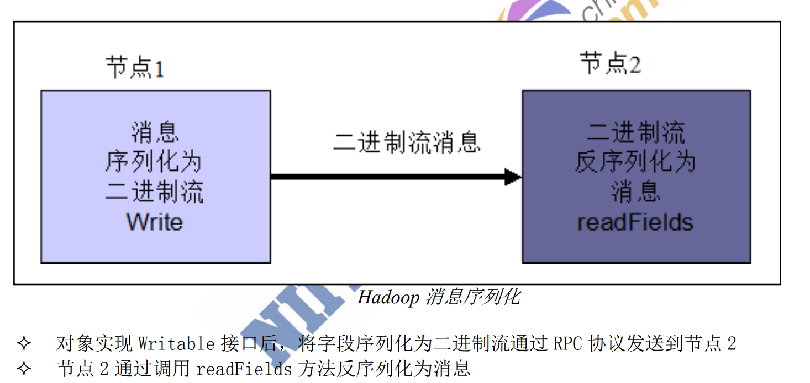

## 5）WritableComparable

- **WritableComparable 接口是可序列化并且可比较的接口，MapReduce 中所有的 key 值类型都必须实现 这个接口。**

## 6）压缩:smile:

- GZIP:
  - 压缩率较高，速度较快，hadoop本身就支持，使用方便，支持 hadoop native 库
  - 不支持split
  - 当每个文件压缩之后在 130M 以内的（1 个块大小内），都可以考虑用 gzip 压缩格式
- LZO：
  - 压缩速度很快，压缩率合理，支持split，hadoop最流行的压缩格式
  - 压缩率比gzip低，hadoop本身并不支持，需要安装
  - 应用场景：一个很大的文本文件，压缩之后还大于 200M 以上的可以考虑，而且单个文件越大，lzo 优点越越明显。
- Snappy:
  - 高速压缩速度和合理的压缩率；支持 hadoop native 库
  - 不支持 split；压缩率比 gzip 要低；hadoop 本身不支持，需要安装；linux 系统下没有对应 的命令。
  - 应用场景：mapreduce中map输出的数据较大，可作为map到reduce的中间数据的压缩格式
- bzip2
  - 支持 split；具有很高的压缩率，比 gzip 压缩率都高；hadoop 本身支持，但不支持 native
  - 压缩/解压速度慢；不支持 native。
  - 适合对速度要求不高，但需要较高的压缩率的时候，可以作为 mapreduce 作业的输出格 式；或者输出之后的数据比较大，处理之后的数据需要压缩存档减少磁盘空间并且以后数据用得比 较少的情况；或者对单个很大的文本文件想压缩减少存储空间，同时又需要支持 split，而且兼容之 前的应用程序（即应用程序不需要修改）的情况。
- **CompressionCodec 对流进行压缩和解压缩**
- 每一种编码器(Compressor)/解码器(Decompressor)最后统一的交由编码解码器(CompressionCodec) 来管理
- 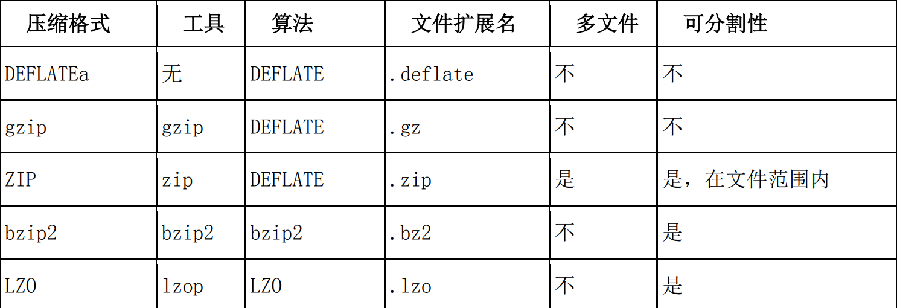

-----

### 暂时没搞明白 实现原理。:sob:


## 7）特殊文件处理 :cry:

- 需求：在处理小文件上低效率和小号磁盘空间的问题
- SOlUTION:使用容器：SequenceFile  MapFile

SequenceFile：一种二进制文件支持，直接将<key,value>对序列化到文件中。

- 支持压缩，定制基于record或block压缩
- 简单

在SequenceFile文件中，每一个KV被看作一条记录，所以基于Record的压🔒策略，可以支持三种压缩类型：

- None：对record不压缩
- RECORD:仅仅压缩每一个record中的value
- BLOCK:将一个block中所有records压缩

**创建SequenceFile**

```java
Remains to be done;
```


# RPC协议

## 1）定义

远程方法调用，允许计算机程序远程调用另一台计算机的子程序。

## 2）Feature

- 透明性：远程调用其他机器上的程序，对用户来说就像是调用本地方法一样；
- 高性能：RPC server 能够并发处理多个来自 Client 的请求

## 3）C/S 模式

- Client 端发送一个带有参数的请求信息到 Server
- Server 接收到这个请求以后，根据发送过来的参数调用相应的程序，然后把自己计算好的结果 发送给 Client 端；
- Client 端接收到结果后继续运行


# Hadoop prc机制

#### 1.RPC设计要求

- 序列化层：C与S端通信采用了hadoop的序列化类或自定Writable类型
- 函数调用层：Hadoop RPC通过动态代理以及java反射实现函数调用
- 网络传输层：采用了基于TCP/IP的socket机制
- 服务器端框架层：知识盲区


## 核心框架原理

- 优点：易于编程，只用关系业务逻辑
  - 良好拓展性：可以动态增加服务器，解决计算资源不够的问题
  - 高容错性：任何一台机器挂掉，可以将任务转移到其他节点
  - 适合海量数据的计算（TB/PB) 几千台服务器共同计算
- 不擅长实时计算（mysql这样的擅长）
- 不擅长流式计算（Sparkstreaming flink）
- 不擅长DAG有向无环图计算 spark

#### 1）MapReduce阶段（引用图）

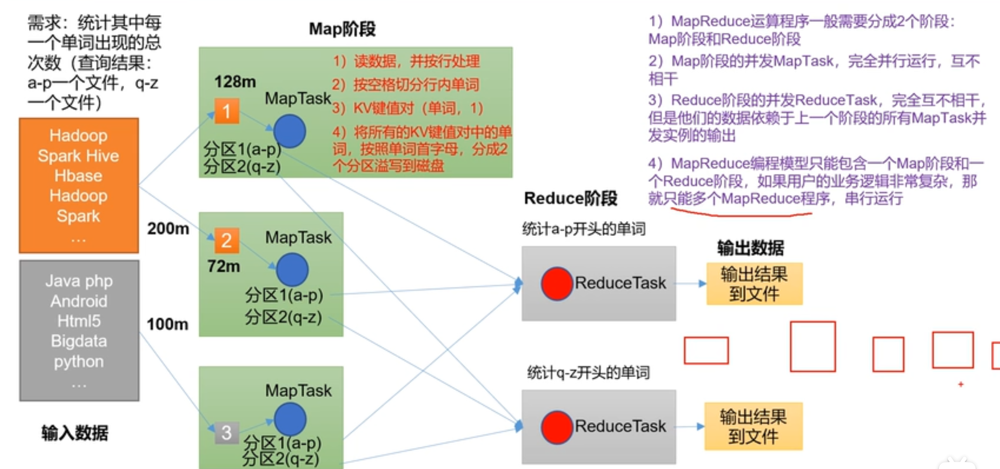


#### 2）MapReduce进程

一个完整的MapReduce程序在分布式运行时有三类实例进程

- MrAppMaster:负责整个程序的过程调度和状态调度
- MapTask：负责整个Map阶段的整个数据处理流程
- ReduceTask：负责整个Reduce阶段的整个数据处理流程

#### 3）MapReduce的编程规范

- Map阶段
  - 用户自定义的Mapper需要继承自己的父类
  - Mapper的输入数据是KV对的形式（类型可以自定义）
  - Mapper中的业务逻辑实现在map方法中
  - Map的输出数据也是KV对的形式（同样可以自定义类型）
  - Map方法对每一个<K,V>调用一次（一行一行的调用，多次使用map）
- Reduce阶段
  - 继承父类
  - reducer的输入数据类型对应mapper的输出类型
  - Reducer的业务逻辑写在reduce阶段
  - ReduceTask进程对每一组k的<k,v>带哦用一次reduce方法（多少K就进行多少次reduce）
  - 

- Driver：相当于Yarn集群的客户端，用于提交我们整个正序到YARN集群，提交的是封装了MapReduce程序相关运行参数的job对象

# MapReduce

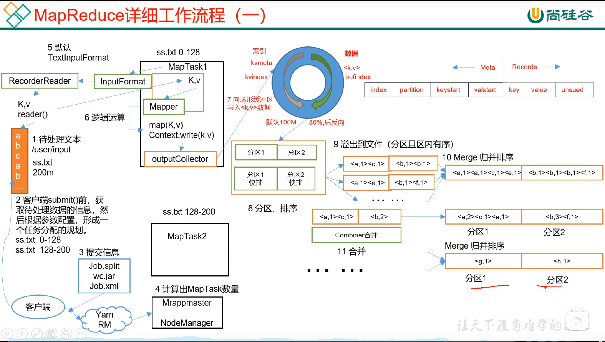

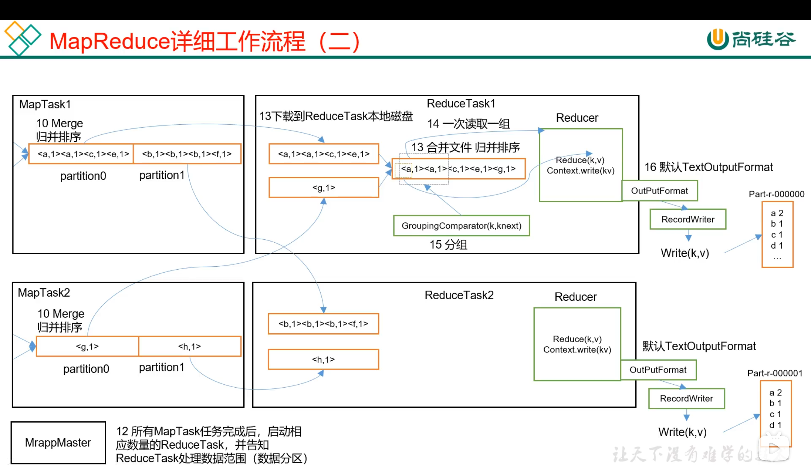

### 1.输入的数据InputFormat数据输入 

**Map切片大小设置为block大小时，效率最高**

- 1）一个job的Map阶段并行度由客户端在提交Job时的切片数决定（切了多少片，多少个Maptask  **注意每一个文件需要单独切**）
- 2）每一个Split切片分配一个MapTask并行实例处理
- 3）默认情况，切片大小=BlockSize
- 4）切片时不考虑数据集整体，而是逐个针对每一个文件单独切片

Job提交流程源码分析

```java
waitForCompletion()
   submit();
//1 建立连接
	connect();
		//1)创建提交Job的代理
		new Cluster(getConfiguration());
			//(1) 判断是本地运行环境还是yarn运行环境
			initialize(jobTrackAddr,conf);
//2 提交Job
	submitter.submitJobInternal(Job.this,cluster)
        // 1）创建给集群提交数据的Stag路径
        Path jobStagingArea = JobsubmissionFiles.getStagingDir(cluster,conf)
        //2) 获取jobid 并创建job路径
        JobID jobId = submitClient.getNewJobID();
		//3)如果是集群模式 拷贝jar包到集群
		copyAndConfigureFiles(job,submitJobDir)
rUploader.uploadFiles(job,jobsubmitDir)
        //4) 计算切片，生成切片规划文件
        //5) 向stag路径写XML配置文件
        //6) 提交JOB，返回提交状态
```

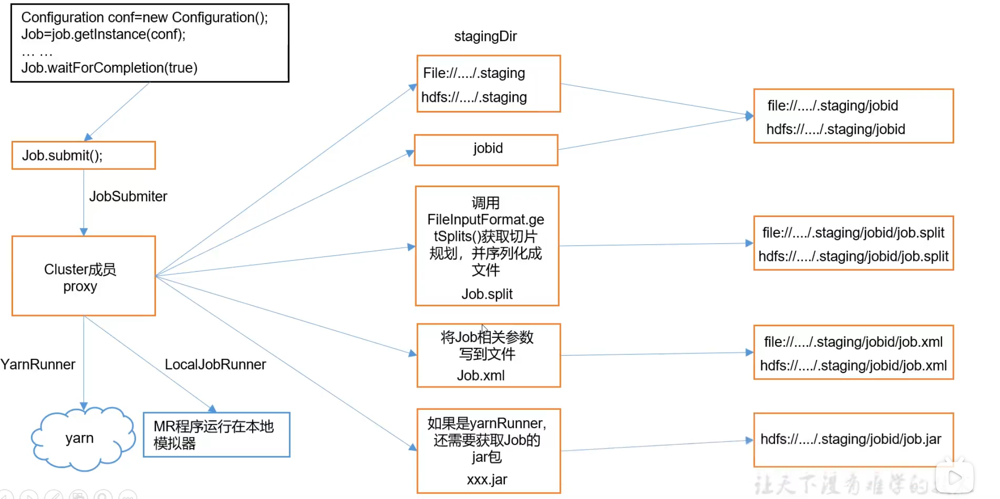


##### a.FileInputFormat切片源码解析

```java
1)程序先找到数据存储的目录
2)遍历处理目录下的每一个文件
3)遍历第一个文件ss.txt
    a)获取文件大小fs.sizeOf(ss.ttx)
    b)计算切片大小    computeSplitSize(Math.max(minSize,Math,min(maxSize,blockSize)))=blocksize=128M
	c)默认情况下切片大小都是blocksize
    d)开始切，形成第一个切片：ss.txt-0:128M 第二个切片ss.txt-128:256
    e)将切片信息写到一个切片规划文件中
    f)整个切片的核心过程再getSplit()方法完成
    g)InputSplit只记录了**切片的元数据信息**,比如起始位置、长度以及所在的节点列表
4)提交切片规划文件到YARN上，YARN上的MrAppMaster就可以根据切片规划文件计算开启MapTask的个数
```

TextInputFormat是FileInputFormat的实现类 <Longwritable,Text>

键是存储改行再整个文件中的起始字节偏移量，V是这行的内容

-----

KeyValueFormat <Text , Text>  第0位 KEY 后面是 Value

##### b.CombineTextInputFormat切片机制

CombineTextInputFormat处理方式是一次读取多个文件，把所有文件集合再一起处理.

应用场景：用于小文件过多的场景，因为再默认框架中

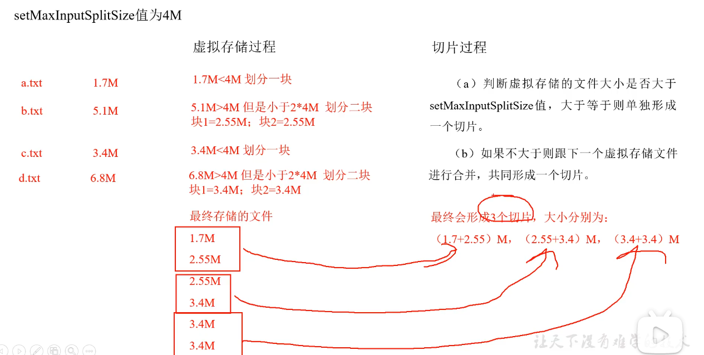

### 2.Shuffle

- map方法之后。reduce方法之前的过程都成为Shuffle
- 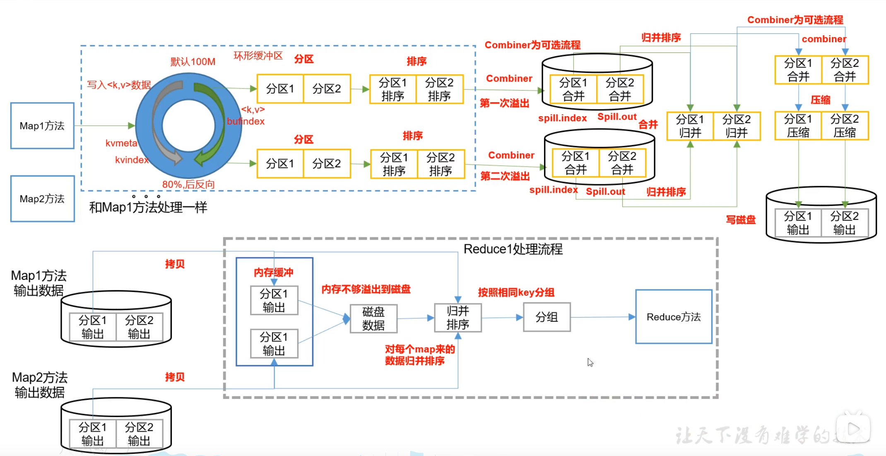

####  **a.Partitioner**

- 注意：ReduceTask默认为1时，不会走默认的patitioner那个类，而是会运行那个一个内部类使得只有0这个分区

- 问题：要求将统计结果按照条件输出到不同为你暗中（分区），归属地不同省份输出到不同文件中（分区）

- 默认分区是根据key的hashcode对Reduce'Task个数取模得到的。用户没法控制哪个Key存储到那个分区

- 自定义Partitoner步骤

  - 1）自定义类继承Partitioner，重写getPartitioner方法

  - ```java
    public class www extends Partitioner<Text,FlowBean>{
        @Override
        public int getPartitioner(Text key,FlowBean value,int numpartitions)
            //控制分区代码业务逻辑
            
            ........
            return partition;
    }
    ```

  - 2）在job驱动中，设置自定义Partioner

  - ```java
    job.setPartitionerClass(CustomPartitioner.class)
    ```

  - 3）自定义partitioner后，需要根据逻辑设置相应数量的ReduceTask

  - 4）如果reduceTask数量大于getPartitioner的结果数，则会产生几个空的

  - 5）如果reduceTask数量大于1 小于getPartitioner的结果数，则有一部分分区数据无法安防，报错

  - 如果reduceTask的数量为一，不管MapTask输出多少个分区的文件，结果都交由一个reduceTask，也就是产生一个结果文件。

#### b.全排序

FlowBean需要实现WritableComparable接口重写compareTo()方法

#### c.二次排序

#### d.区内排序

#### e.Combiner

会对Key相同的进行合并，并且在MapTask处理一部分合并会提高效率（注意：不是所有都适用）

- Combiner不属于Mapper和Reducer
- combiner组件的父类是Reducer
- Combiner和Reducer的区别在于运行的位置：前者在MapTask运行
- 自定义：基于wordCount的案例  自定义Combiner


### 3.输出数据OutputFormat

- 核心方法：recordWriter决定写出类型
- 自定义outputFormat：
  - 过滤输出日志，包含atguigu的网站输出到...，不包含....的输出到....
  - 创建一个类LogRecordWriter继承RecordWriter
    - (a) 创建两个文件的输出流：aout，bout
    - (b)符合a条件的输出到aout ，其他的输出到bout
    - (c) 要将自定的输出格式组件设置到job中

### 4.Join

### 5. ETL

### 6.总结

### 7.Yarn在Mapreduce中的作用


