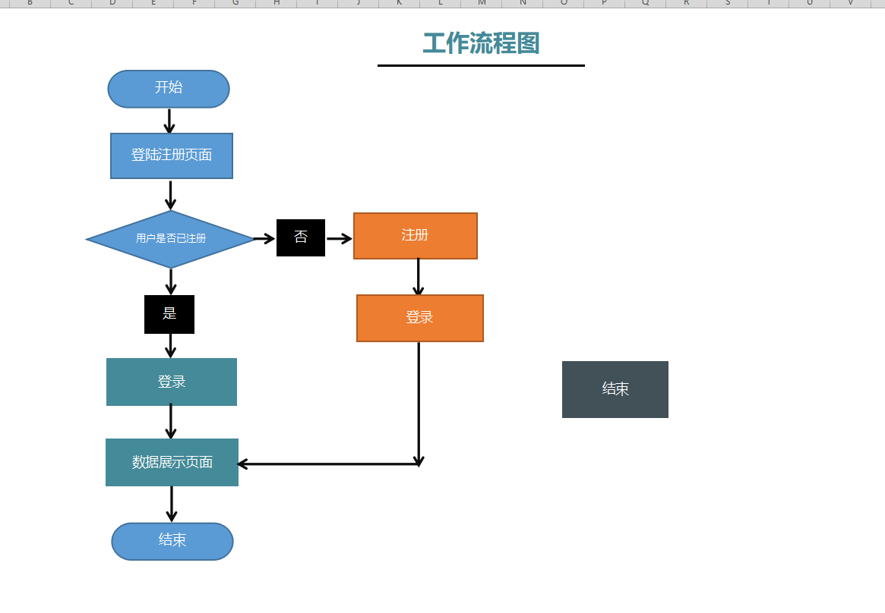

[TOC]

# 1.introduction 

## 1.1Purpose

- This specification is written to analyze and summarize the basic requirements of the project and describe the basic requirements and functional characteristics of the functional modules.

- The name of this project is called "Super Store Data Analysis", and users can get the following information through this website 
  - Top 10 products with sales volume greater than 1000 
  - total sales in each order priority where quantity is even number
  - 10 countries whichi have lowest minimutes sales
  - top 10 customers based on the no of letters in their time
  - total quantity in each market where pofit is greater than 100

## 1.2 How to run the project

- you need to install node8.0+  and you'd better use vs code open our Three.js project && run java part in idea which is deployed on tomcat.
- After all the preparations have been made,you need to run tomcat firstly , and then open Three.js project in vs code ,then open a terminal in it, input "npm run dev"，and wait a minute ,it takes time to deploy website,then you can see what our video shows.

# 2.Project Overview

## 2.1product description

Build a web3d website through Three.js, and realize information interaction and user registration, login and other functions through jsp and mysql, and display the data through flourish.

## 2.2Product Features

This project can implement a simple online registration, login function, and use hive to process data. Such as the flow chart:

# 3.specific requirement

## 3.1use case description

| Example name   |                View Super store related data                 |
| -------------- | :----------------------------------------------------------: |
| Performer      |                      User Administrator                      |
| Use Case Brief |           Specifies how to use the system to query           |
| precondition   |       User identity needs to be properly authenticated       |
| postcondition  |          Return the corresponding data as required           |
| Basic process  | 1. If you enter the system for the first time, return to the registration page 2. If the registration is successful, return to the login page 3. Click the "query" button 4. Enter the data display page |

