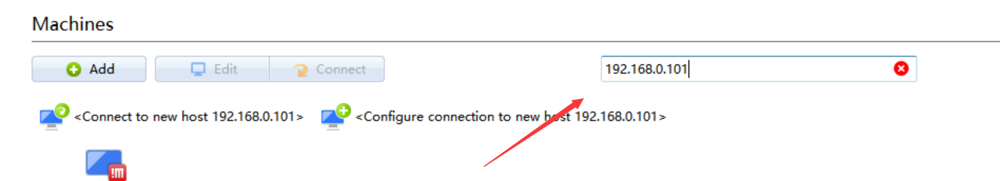
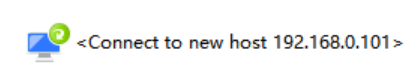

1. **我还没转换成ap模式 所以你就暂时使用路由连接**（只用给路由器通电 然后连接网线一端插在路由的Lan随便一个接口 另一端插小车上）🚚
2. 你电脑也要连接这个路由的wifi信号  WLAN名字是：419-1  管理密码是418418418
3. 然后登录tplogin.cn  输入管理密码 进入界面点击设备管理看小车的ip地址 应该是192.168.0.101
4. 然后点击tools压缩包里的nomachine安装  然后 👉**管理员的方式运行**👈nomachine
5. 
6.  
7. 点击进去后账号和密码随便取一个 记住就行（**一定要是管理员运行  不然会闪退**）
8. 然后你进去会看到一个ubuntu18的界面 点开terminal📑
9. 一般的运行流程是这样的（我以打开摄像头为例子奥）
   1. 先打开一个terminal 输入roscore  回车✍
   2. 在打开一个terminal 输入roslaunch robot_vision robot_camera.launch🎃
   3. 再新开一个terminal输入rqt_image_view 回车 这样就可以查看图像了👀
   4. 其他的都差不多的 就是要注意每新发布一个话题 你都需要新开一个terminal并且roscore是需要第一个打开的
